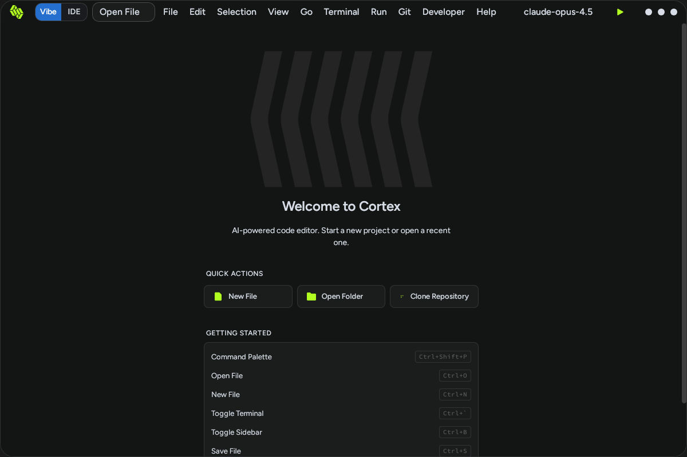

# [BUG] [v0.0.7] Git Menu Dropdown Does Not Open When Clicked

**Severity:** Medium  
**Component:** UI/Menu System

## Description
When clicking the "Git" menu in the top menu bar, no dropdown menu appears. The click is completely unresponsive and no menu options are displayed.

## Steps to Reproduce

1. Launch Cortex Desktop IDE
2. Navigate to the top menu bar
3. Click the "Git" menu item located between "Run" and "Developer"
4. Observe the result

**Observed Result:** No dropdown menu appears, no options shown, UI remains unchanged.

## Expected Behavior

Clicking the "Git" menu should display a dropdown with Git-related options such as:
- Initialize Repository
- Clone Repository
- Fetch/Pull/Push
- Commit Changes
- Branch/Tag management
- Git History/Log
- etc.

## Actual Behavior

The Git menu does not respond to clicks. No dropdown appears, making Git functionality inaccessible via the menu system.

## Screenshots

### Before Clicking (Welcome Screen)

### After Clicking Git Menu (No Dropdown)

Note: Screenshots appear identical - no dropdown menu is visible.

## Video Evidence

**Video:** [git-menu-click.mp4](./evidence/git-menu-click.mp4)

The video demonstrates:
1. 1-2 seconds of baseline IDE state
2. Click on Git menu (x=850, y=50)
3. No dropdown appears after the click
4. UI remains unchanged

## System Information

- Cortex version: v0.0.6 (based on build logs)
- Platform: Linux (Ubuntu 24.04)
- Display: Xvfb virtual display (:99)
- Test Date: 2026-02-22

## Additional Context

This bug affects all top-level menus (File, Edit, Selection, View, Go, Terminal, Run, Git, Developer, Help) - none of them show dropdowns when clicked.

Users cannot access:
- Git operations via menu
- File operations via menu
- View/terminal preferences via menu
- Any functionality that requires menu navigation

## Related Issues

All top-level menus exhibit this same behavior. This is likely a shared menu system issue affecting the entire IDE.
