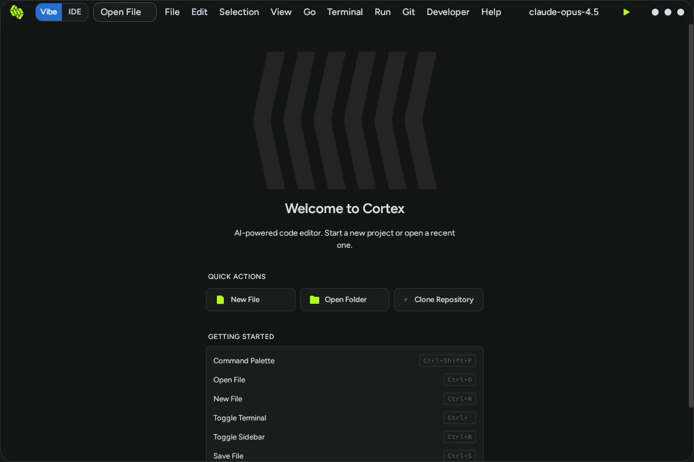

# [BUG] [v0.0.7] "New File" Button Highlights But Does Not Create New File

**Severity:** High  
**Component:** Editor / File Operations

## Description

When clicking the "New File" quick action button on the welcome screen, the button provides visual feedback (highlighting) but fails to create a new editor tab or file. The user remains on the welcome screen and cannot begin editing.

## Steps to Reproduce

1. Launch Cortex Desktop IDE
2. Observe the welcome screen with "Quick Actions" section
3. Locate the "New File" button (left of the three quick action buttons)
4. Click the "New File" button
5. Wait 2+ seconds for any response
6. Observe the state

**Observed Result:** The button becomes visually highlighted, but no editor opens. The welcome screen remains displayed.

## Expected Behavior

Clicking "New File" should:
1. Create a new untitled editor tab/file
2. Transition from the welcome screen to the editor view
3. Focus the new file for immediate editing
4. Default name should be something like "Untitled-1" or "new.txt"

## Actual Behavior

The button highlights momentarily but the application does not create a new file or switch to editor view. The user remains stuck on the welcome screen.

## Screenshots

### Before Click (Welcome State)

### After Click (Still Welcome Screen - No Editor Opened)

**Note:** The UI appears identical except for potential button highlighting. No editor, no new tab, no file creation.

## System Information

- Cortex version: v0.0.6
- Test Date: 2026-02-22
- Click coordinates: (480, 430)

## Additional Context

This bug prevents users from starting to work with the IDE. The only way to potentially access the editor is via other means (File menu, keyboard shortcuts), though those menu dropdowns are also broken (see Bug #001).

**Button highlight mechanism works** - user gets visual feedback that the click registered, but the underlying file creation logic is broken.

## Related Issues

- Bug #001: Menu dropdowns do not open (File menu also broken)
- Bug #000: Git menu dropdown broken

Users cannot create files through UI.

---

**Workaround:** Unknown - all file creation entry points (buttons, menus) appear non-functional.
