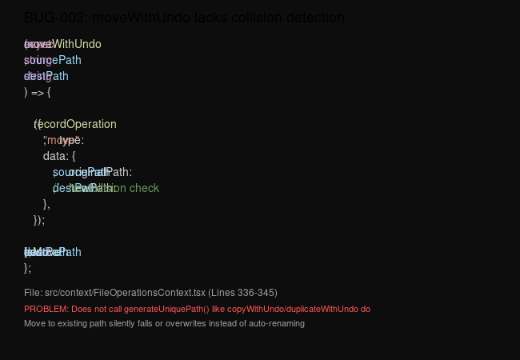

# [BUG] [v0.0.7] moveWithUndo lacks collision detection while copyWithUndo/duplicateWithUndo auto-rename

## Project
ide

## Description
The `moveWithUndo` function does NOT check for path collisions before moving, but `copyWithUndo` and `duplicateWithUndo` both call `generateUniquePath` for collision detection and auto-renaming. This inconsistent behavior creates a silent failure mode for moves:

- Copy a file to an existing destination → Auto-renames to `file (1).txt` (correct)
- Duplicate a file → Auto-renames with ` copy` suffix (correct)
- Move a file to an existing destination → Silent failure or overwrite (incorrect)

## Screenshot


## Evidence

### Code Comparison (FileOperationsContext.tsx)

`moveWithUndo` (no collision handling) — Lines 336-345:
```typescript
const moveWithUndo = async (sourcePath: string, destPath: string) => {
  recordOperation({
    type: "move",
    data: {
      originalPath: sourcePath,
      newPath: destPath,  // ❌ No uniqueness check
    },
  });

  await fsMove(sourcePath, destPath);  // ❌ Fails if destPath exists
};
```

`copyWithUndo` (with collision handling) — Lines 371-389:
```typescript
const copyWithUndo = async (sourcePath: string, destPath: string): Promise<string> => {
  const uniquePath = await generateUniquePath(destPath);  // ✓ Generates unique name

  recordOperation({
    type: "copy",
    data: {
      originalPath: sourcePath,
      newPath: uniquePath,
      isDirectory: false,
    },
  });

  await fsCopyFile(sourcePath, uniquePath);
  return uniquePath;
};
```

`duplicateWithUndo` (with collision handling) — Lines 391-415:
```typescript
const duplicateWithUndo = async (sourcePath: string, isDirectory = false): Promise<string> => {
  const duplicatePath = await generateDuplicatePath(sourcePath, isDirectory);  // ✓ Generates unique name

  recordOperation({
    type: "copy",
    data: {
      originalPath: sourcePath,
      newPath: duplicatePath,
      isDirectory,
    },
  });

  // ... copy operation
};
```

## Steps to Reproduce

### Scenario 1: Move to existing file in File Explorer
1. Open the cortex-ide project
2. In File Explorer, navigate to a folder with at least one file (e.g., `src/context/`)
3. Right-click a file (e.g., `SnippetsContext.tsx`) → "Duplicate"
4. Result: Creates `SnippetsContext copy.tsx` (works correctly)
5. Now select the original `SnippetsContext.tsx` → Cut (Ctrl+X)
6. Paste in the same directory
7. **Expected**: Renames to `SnippetsContext (1).tscx` or similar
8. **Actual**: Silent failure or overwrite (move silently fails)

### Scenario 2: Move via drag-drop
1. Create two files in same directory: `a.txt`, `b.txt`
2. Edit `a.txt` with content "A"
3. Edit `b.txt` with content "B"
4. Drag `a.txt` onto `b.txt` (attempting to rename/overwrite via drag)
5. **Expected**: Either prompt for overwrite or auto-rename
6. **Actual**: Silent failure with no error shown

## System Information
- Cortex IDE: v0.0.7
- OS: Linux (affects all platforms)
- Component: File Operations Context (file tree operations)

## Root Cause
**File**: `src/context/FileOperationsContext.tsx`
**Line**: 336-345

`moveWithUndo` directly uses the provided `destPath` without calling `generateUniquePath` to check for collisions. The underlying Rust implementation (`fsMove`) likely fails silently or overwrites when the destination exists.

`copyWithUndo` and `duplicateWithUndo` both use `generateUniquePath` from `src/utils/fileUtils.ts:77-121` which checks filesystem existence and generates escaped names like `file (1).txt`.

## Expected Behavior
When moving a file to an existing destination path:
- Either auto-rename (matching copy/duplicate behavior)
- Or show a conflict resolution dialog
- Error should be visible to user, not silent

## Actual Behavior
Move operation silently fails or overwrites existing file with no error notification or conflict resolution.

## Fix Suggestion

```typescript
const moveWithUndo = async (sourcePath: string, destPath: string) => {
  // Generate unique path if destination exists (match copyWithUndo behavior)
  const uniquePath = await generateUniquePath(destPath);

  recordOperation({
    type: "move",
    data: {
      originalPath: sourcePath,
      newPath: uniquePath,
    },
  });

  await fsMove(sourcePath, uniquePath);
};
```

Alternative: Add `uniquePath` return type and return it (matching `copyWithUndo` signature).

## Related Files
- `src/context/FileOperationsContext.tsx` (lines 336-415)
- `src/utils/fileUtils.ts` (lines 77-121 `generateUniquePath`, 123-157 `generateUniquePathsForBatch`)
- `src/components/FileExplorer.tsx` (lines 2275, 2478 — calls to `copyWithUndo` and `duplicateWithUndo`)
